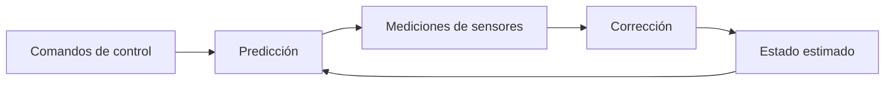

# Localización probabilística de un robot móvil 2D (EKF · UKF · MCL)

## Descripción
Proyecto académico del Máster en Robótica y Automatización (UEM) orientado a **implementar y comparar** algoritmos de estimación de estado para la localización de un **robot móvil diferencial 2D** en un entorno conocido, considerando **ruido en sensores y odometría**.

Algoritmos objetivo:
- Filtro de Kalman Extendido (EKF)
- Filtro de Kalman Unscented (UKF)
- Localización Monte Carlo (MCL / AMCL)

El foco del proyecto está en:
- Implementación del ciclo **predicción → corrección**
- Evaluación **cualitativa** (trayectorias y evolución temporal)
- Evaluación **cuantitativa** (métricas de error)

## Objetivos
- Implementar EKF, UKF y MCL/AMCL para estimación de pose \((x, y, \theta)\).
- Comparar desempeño bajo distintos niveles de ruido.
- Generar entregables reproducibles: scripts, gráficas, métricas e informe técnico.

## Modelo del sistema
Robot móvil diferencial 2D con modelo cinemático:

```text
x_t = x_{t-1} + v · cos(θ_t) · Δt
y_t = y_{t-1} + v · sin(θ_t) · Δt
θ_t = θ_{t-1} + ω · Δt
```

Donde:
- (x, y): posición
- θ: orientación
- v: velocidad lineal
- ω: velocidad angular
- Δt: intervalo de integración

## Arquitectura (ciclo de localización)


## Algoritmos (resumen)
### EKF (Extended Kalman Filter)
- Linealiza el modelo mediante Jacobianos.
- Asume ruido gaussiano.
- Adecuado para no linealidades moderadas.

### UKF (Unscented Kalman Filter)
- Propaga puntos sigma para aproximar la distribución.
- Mejor aproximación en sistemas no lineales.
- Mayor coste computacional que EKF.

### MCL / AMCL (Monte Carlo Localization)
- Representación mediante partículas.
- Remuestreo basado en probabilidad.
- Robusto ante distribuciones no gaussianas.

## Estructura del repositorio (prevista)
- `src/` scripts principales (estimadores + utilidades)
- `results/` figuras y métricas (RMSE, MAE, etc.)
- `report/` informe (PDF)

## Requisitos
- MATLAB R2021a o superior (recomendado 2023a+)
- Toolboxes:
  - Robotics System Toolbox
  - Navigation Toolbox
  - Statistics and Machine Learning Toolbox

Opcional:
- Python 3.7+
- EVO Toolkit: https://github.com/MichaelGrupp/evo

## Cómo ejecutar
Pendiente: se añadirá una guía de ejecución cuando esté integrado el primer estimador.

## Resultados
Pendiente: se publicarán gráficas y métricas comparativas cuando estén disponibles.

## Estado del proyecto
Inicio.

## Licencia
MIT (ver archivo `LICENSE`).

## Autor
Miguel Ángel Chávez
